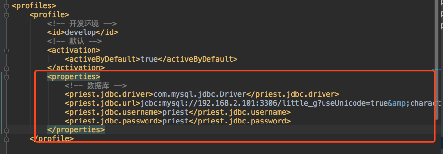
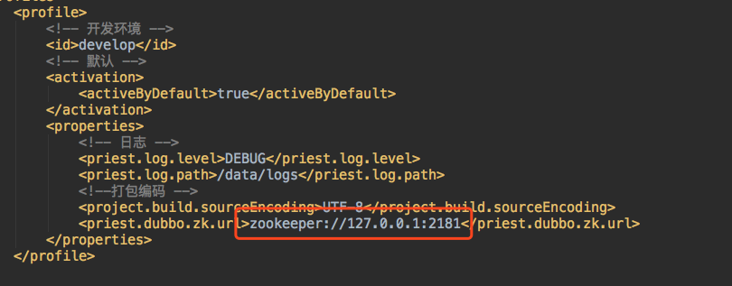
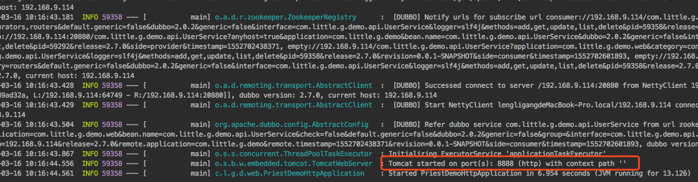

# priest
 dubbo mybatis springboot base soa rest api framework with customer code generator


## 前言


   `priest`项目是一个以 **incubator-dubbo** - **Spring Boot** - **Mybatis3** 为基础的SOA开源开发框架
   
## 项目介绍
   
   `priest`项目基于springboot+dubbo+mybatis的分布式敏捷开发框架，将 **JSR303** **hibernate-validate** 验证体系完美融合**dubbo**服务框架。并以此为基础开发了maven-code-generator 插件，让研发人员从重复的增删改查工作中彻底解脱。
 
   本项目为后续开源的所有项目的基石项目，后续计划陆续的开源项目将会有 **用户中心**  **支付中心** 敬请期待！
   
   **文档陆续补充中**
   

### 组织结构


```lua

├── dubbo   --dubbo 打包部署相关配置及启动脚本
│   ├── assembly
│   └── bin
├── dubbo-extend  --dubbo 扩展支持dubbo接口参数校验
├── plugin-test   --maven plugin 测试项目
├── priest-common --priest 项目公用模块
├── priest-common-web --priest 项目共用web服务
├── priest-demo 	 --priest 服务化样例项目
│   ├── priest-demo-api 	--priest 服务化样例api项目
│   ├── priest-demo-dao 	--priest 服务化样例dao项目
│   ├── priest-demo-http 	--priest 服务化样例http项目
│   └── priest-demo-service  --priest 服务化样例dubbo服务项目
└── priest-generator  --priest 代码生成插件项目
  
```

##Getting Started
-------

### 项目依赖
1. mysql 数据库
2. zookeeper 注册服务

### 项目编译

1. 进入项目根目录
2. 打开项目 priest-demo/priest-demo-dao/src/main/resources/demo.sql 建立创建测试数据库及表
3. 修改 priest-demo/priest-demo-dao/pom.xml develop profile 关于jdbc的配置见下图
	
	
	
4. 修改 根目录pom.xml develop profile 关于zookeeper配置见下图  
	 
	
5. 进入项目根目录
6. `mvn clean install -Pdevelop`

### 项目运行

1. dubbo service 启动

 运行  `priest-demo/priest-demo-service/src/test/java/com/little/g/demo/TestDubbo.java main`
 
2. http 启动
	
   * 进入priest-demo/priest-demo-http 项目目录 
   * 执行 `mvn spring-boot:run`  ，观察控制台日志输出，出现如下日志，便是启动成功了。

	 

 


### 关键配置

### 开发流程

#### dao 生成

#### api 生成

#### service 生成

#### http 生成


   

 
 


